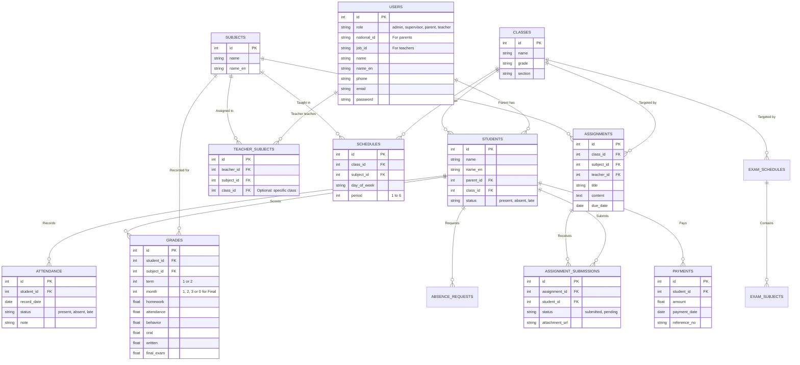

# تحليل مشاريع "أنوار العلا" وتصميم قاعدة البيانات (ERD)

بناءً على تحليل الأكواد المصدرية للمشاريع الثلاثة (لوحة تحكم الإدارة، تطبيق فلاتر لولي الأمر، تطبيق فلاتر للمعلم)، إليك التقييم الشامل وتصميم قاعدة البيانات المقترح.

---

## 1. تحليل المشاريع والملاحظات (Feedback)

### 🖥️ لوحة تحكم الإدارة (Dashboard)
- **الحالة الحالية:** واجهة مستخدم مبنية بـ React، منظمة بشكل جيد من حيث المكونات (Components) والصفحات (Tabs).
- **الملاحظات التقنية:**
  - **البيانات الوهمية:** النظام حالياً لا يعتمد على قاعدة بيانات حقيقية، بل جميع البيانات (الطلاب، المعلمون، التقييمات) مخزنة بشكل صلب (Hardcoded) كحالة (State) داخل ملف `AppContext.jsx` الذي يبلغ حجمه تقريباً 95KB.
  - **الأداء:** وجود هذا الكم الهائل من البيانات في Context واحد سيؤدي إلى مشاكل في الأداء (Re-renders) مع كثرة البيانات مستقبلاً.
  - **توصية:** يجب نقل إدارة البيانات إلى واجهة خلفية (Backend API) حقيقية. تم ملاحظة وجود `laravel/sanctum` في `composer.json` مما يوحي بوجود نية لربطها بـ Laravel. يجب الإسراع في هذه الخطوة.

### 📱 تطبيق المعلم (Anwar Teacher)
- **الحالة الحالية:** تطبيق فلاتر منظم، يحتوي على نماذج (Models) واضحة للتعامل مع الدرجات (AcademicGrade) والطلاب والتحضير.
- **الملاحظات التقنية:**
  - نموذج التقييم (Grading) معقد وممتاز، حيث يقسم التقييم إلى ترمين (Term 1 & Term 2)، وكل ترم يحتوي على 3 أشهر، وكل شهر يحتوي على تقييمات تفصيلية (واجبات 15، مواظبة 15، سلوك 10، شفوي 10، تحريري 50).
  - **توصية:** النماذج الحالية تعتمد على `toMap` و `fromMap` اليدوية. يُفضل استخدام حزم لتوليد الأكواد مثل `json_serializable` أو `freezed` لتجنب الأخطاء المطبعية في التعامل مع JSON من الـ API.

### 📱 تطبيق ولي الأمر (Anwar Parent)
- **الحالة الحالية:** تطبيق فلاتر احترافي يستخدم بنية (Feature-First Architecture) مع إدارة حالة حديثة عبر `Riverpod`.
- **الملاحظات التقنية:**
  - التطبيق مقسم بشكل رائع إلى مجلدات ميزات (Features) مثل `grades`, `attendance`, `fees`, `assignments`، مما يجعله سهل الصيانة والتطوير.
  - نماذج البيانات (Models) متوافقة تماماً مع ما يعرضه المعلم وما تديره لوحة التحكم.
  - **توصية:** التطبيق جاهز تقريباً للربط، فقط يحتاج إلى استبدال البيانات الوهمية (Mock Data) في الـ Providers بـ API Calls حقيقية.

---

## 2. تصميم قاعدة البيانات (Database Schema & ERD)

لربط هذه المشاريع الثلاثة معاً، يجب بناء قاعدة بيانات مركزية تلبي احتياجات الجميع. إليك هيكل الكيانات والجداول المطلوبة:

### 📊 المخطط الكياني (Mermaid ERD)

### 📝 شرح الجداول الرئيسية (Entities):

1. **جدول المستخدمين `USERS`**: 
   - يخزن جميع حسابات الدخول (مدير، مشرف، معلم، ولي أمر) باستخدام عمود `role`.
   - يستخدم المعلم `job_id` كرقم وظيفي، بينما يستخدم ولي الأمر `national_id` (رقم الهوية).

2. **جدول الطلاب `STUDENTS`**:
   - يرتبط بولي الأمر `parent_id` (بذلك يمكن لولي الأمر رؤية أكثر من ابن في حسابه).
   - يرتبط بالفصل `class_id` لمعرفة صف وشعبة الطالب.

3. **جداول الفصول والمواد `CLASSES` & `SUBJECTS`**:
   - يتم ربط المعلم بالمادة والفصل من خلال جدول وسيط `TEACHER_SUBJECTS` لتحديد صلاحية المعلم (أي فصول يدرسها وأي مواد).

4. **جدول الدرجات `GRADES`**:
   - مصمم ليطابق هيكل `AcademicGrade` الموجود في تطبيق المعلم.
   - يخزن الدرجات مقسمة حسب الترم (`term`) والشهر (`month`)، ويحتوي على أعمدة منفصلة لـ (الواجبات، المواظبة، السلوك، الشفوي، التحريري).
   - إذا كان `month = 0` فهذا يعني أن هذا السجل هو لدرجة الاختبار النهائي (`final_exam`) لذلك الترم.

5. **جداول الغياب والطلبات `ATTENDANCE` & `ABSENCE_REQUESTS`**:
   - يسجل الحضور اليومي لكل طالب. يمكن لولي الأمر إرسال طلب غياب يظهر في Dashboard ليتم الموافقة عليه أو رفضه.

6. **الواجبات `ASSIGNMENTS` & تسليماتها `ASSIGNMENT_SUBMISSIONS`**:
   - ينشئ المعلم الواجب ويستهدِف فصل ومادة محددة. 
   - يقوم الطالب (من خلال تطبيق ولي الأمر) برفع الحل وتغيير الحالة في جدول `ASSIGNMENT_SUBMISSIONS`.

7. **المالية `PAYMENTS`**:
   - لتتبع الرسوم المدرسية والدفعات المسددة لكل طالب، لتظهر في تطبيق ولي الأمر ولوحة التحكم.

---

### 💡 الخطوة القادمة المقترحة
بما أن هناك آثار لمشروع **Laravel** في لوحة التحكم، أنصح بشدة ببناء واجهة برمجة تطبيقات (RESTful API) باستخدام Laravel، وتطبيق هذا المخطط باستخدام (Laravel Migrations & Eloquent Models)، ثم ربط التطبيقات الثلاثة عبر هذه الواجهة.
