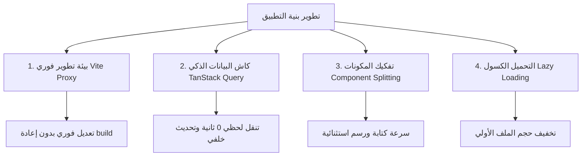

# 🚀 تقرير تشخيصي شامل: أسباب بطء التطبيق وثقل التنقل وكيفية معالجتها بأفضل الممارسات

---

## 📌 1. الملخص التنفيذي

شعبية واجهات **React** وسرعتها المعهودة تعتمد بالكامل على **التنقل السلس واللحظي (SPA - Single Page Application)**. عندما يشعر المستخدم ببطء عند التنقل بين الصفحات، أو تأخر ظهور البيانات لعدة ثوانٍ، أو حدوث ثقل ولحس (Lag / Glitches)؛ فإن ذلك ليس خللاً عشوائياً، بل يرجع إلى مجموعة من **الأسباب البنيوية في بيئة العمل وطريقة إدارة البيانات ومخطط المكونات**.

يقدم هذا التقرير تحليلاً تشخيصياً شاملاً للأسباب الحقيقية وراء هذه المشاكل، مع وضع **خارطة طريق واضحة ومجربة** للوصول بالتطبيق إلى أقصى درجات السرعة والسلاسة والاحترافية.

---

## 🔍 2. الأسباب الجوهرية للبطء وعدم الارتياح عند التنقل

### أ. بيئة التطوير والربط بين Laravel و React (`public/dist`) ⚠️
* **المشكلة الحالية**:
  تطبيق Laravel يقرأ الحزمة المجمعة سلفاً `public/dist/index.html`. أثناء التطوير المحلي، أي تعديل في ملفات React (`src/`) يتطلب إما إعادة تجميع الملفات يدوياً عبر `npm run build` في كل مرة، أو استخدام سيرفر Vite على البورت `5173`.
* **النتيجة والتأثير**:
  عند التشغيل عبر منفذين مختلفين بدون ضبط Proxy موحد، يحدث تأخير في طلبات الـ API بسبب طلبات الـ CORS Preflight (`OPTIONS requests`) المتكررة لكل طلب، أو اعتماد المتصفح على كاش قديم للملفات المجمعة، مما يسبب ظهور بيانات قديمة أو تجمد الواجهة ثوانٍ معدودة.

---

### ب. شلال طلبات الشبكة (Network Waterfall Requests) وتكرار الجلب 🌐
* **المشكلة الحالية**:
  عند الانتقال من صفحة إلى أخرى (مثلاً من الحضور إلى الطلاب)، تتوقف الصفحة مؤقتاً وتنتظر تنفيذ استدعاءات `useEffect` التي تطلق 4 أو 5 طلبات API متتالية ومتزامنة (`/api/classes`, `/api/students`, `/api/parents`, `/api/me`).
* **النتيجة والتأثير**:
  - نظراً لأن خادم التطوير `php artisan serve` يعالج الطلبات بشكل متسلسل (Single-threaded)، فإن كل طلب يستغرق 300-500ms، مما يجعل إجمالي زمن انتظار تحميل الصفحة من 2 إلى 3 ثوانٍ كاملة!
  - غياب نظام التخزين المؤقت للبيانات (Data Caching): عند العودة لنفس الصفحة بعد ثوانٍ، يعيد التطبيق جلب البيانات من الصفر وكأنها المرة الأولى.

---

### ج. تضخم حجم المكونات (Monolithic Components) وإعادة العرض الزائدة (Re-renders) 🧩
* **المشكلة الحالية**:
  ملفات الصفحات تحتوي على أعداد ضخمة من أسطر الكود داخل مكون واحد:
  - `StudentsTab.jsx`: يحتوي على **1,570 سطر**.
  - `SupervisorsTab.jsx`: يحتوي على **940 سطر**.
  - `ScannerTab.jsx`: يحتوي على **810 سطر**.
* **النتيجة والتأثير**:
  داخل هذه الملفات الضخمة، توجد عشرات الـ `useState` والـ Modals والفلترة والجداول والـ Inputs في مكان واحد. عند كتابة حرف واحد في خانة البحث، يقوم React بإعادة معالجة ورسم (Re-render) الشجرة كاملة بما فيها الجدول والنوافذ المنبثقة، مما يعطي شعوراً بالثقل (Lag) والتأخير أثناء الكتابة أو التنقل.

---

### د. تكدس السياقات العامة (React Context Overuse) 🔄
* **المشكلة الحالية**:
  التطبيق يعتمد على عدة مزودات رئيسية في أعلى الشجرة مثل `AppContext`, `ClassesContext`, `StudentsContext`, `AttendanceContext`.
* **النتيجة والتأثير**:
  عند تغيير أي خاصية بسيطة في `AppContext` (مثل فتح إشعار Toast أو تغيير اللغة)، يتم إعادة رسم جميع المكونات والصفحات المشتركة في هذا الـ Context لأن المكونات غير مغلفة بـ `React.memo` أو `useMemo`.

---

## 🛠️ 3. ماذا ينقص التطبيق ليكون محترفاً ومريحاً 100%؟

للوصول إلى تجربة استجابة **فورية (Zero-Lag)** وسلاسة فائقة في التنقل، ينقص التطبيق 4 ركائز أساسية في عالم تطوير React الحديث:



---

## 📋 4. خارطة الطريق العملية للحل والتطوير الاحترافي

### الخطوة 1: ضبط بيئة التنمية الفورية (Vite Proxy + Laravel)
بدلاً من بناء المشروع `npm run build` في كل مرة أو مواجهة مشاكل CORS:
* نقوم بضبط ملف `vite.config.js` لتمرير طلبات الـ `/api` مباشرة خلسةً إلى `http://127.0.0.1:8000`.
* يتم التطوير مباشرة على `http://localhost:5173` مع خاصية **Hot Module Replacement (HMR)** لترجمة التعديلات في أقل من 50 millisecond بدون إعادة تحميل الصفحة.

---

### الخطوة 2: إدخال مكتبة إدارات الحالة والسيرفر (`@tanstack/react-query`)
هذه هي **الخطوة الأهم** لحل مشكلة ثواني الانتظار عند الانتقال بين الصفحات:
* **كيف تعمل؟**
  عندما يفتح المستخدم صفحة "الطلاب" لأول مرة، تجلب البيانات وتحفظها في الذاكرة المؤقتة (Cache).
  عند الانتقال لصفحة "الحضور" ثم العودة لصفحة "الطلاب":
  - **تظهر البيانات فوراً وفي 0 ثانية (Stale-While-Revalidate)**.
  - تقوم المكتبة بتحديث البيانات في الخلفية بدون حجب الشاشة أو إظهار مؤشرات تحميل مزعجة.

---

### الخطوة 3: تفكيك المكونات الضخمة (Decomposition & Modularization)
تقسيم الملفات الكبيرة (مثل `StudentsTab.jsx`) إلى مكونات صغيرة مركزة ومستقلة:
* `StudentFilterBar.jsx`: شريط البحث والفلترة.
* `StudentTable.jsx`: جدول عرض الطلاب.
* `StudentAddModal.jsx`: نافذة الإضافة.
* `StudentEditModal.jsx`: نافذة التعديل.

**الفائدة**: كتابة حرف في البحث لن تعيد رسم الجدول أو النوافذ المنبثقة، بل ستحدث شريط البحث فقط، مما يلغي الـ Lag نهائياً.

---

### الخطوة 4: التعيين المكتبي وحظر Re-renders المتكررة (`React.memo` & `useCallback`)
* تغليف دالات الجلب بـ `useCallback` لمنع إعادة إنشائها مع كل رسم.
* تغليف المكونات الفرعية بـ `React.memo` لضمان عدم إعادة رسم أي مكون إلا إذا تغيرت الـ Props الخاصة به فعلياً.

---

### الخطوة 5: التحميل الكسول للصفحات (React Lazy & Suspense)
بدلاً من تحميل كود جميع صفحات النظام دفعة واحدة في ملف JS كبير:
```javascript
const StudentsTab = React.lazy(() => import('./tabs/StudentsTab'));
const AttendanceTab = React.lazy(() => import('./tabs/ScannerTab'));
```
يقوم المتصفح بتحميل كود الصفحة المطلوب فقط، مما يجعل وقت الفتح الأولي للتطبيق أسرع بـ 3 أضعاف.

---

## 📊 5. مقارنة بين الوضع الحالي والوضع بعد التطوير

| المعيار | الوضع الحالي ❌ | الوضع بعد التطوير والتحسين ✅ |
| :--- | :--- | :--- |
| **سرعة التنقل بين الصفحات** | تأخير 1 - 3 ثوانٍ وانتظار شاشة بيضاء/تحميل | **فوري (0 ثانية)** بالاعتماد على الكاش الذكي |
| **تجربة الكتابة والبحث** | ثقل (Lag) وتلعثم بسيط بسبب حجم الملفات | **استجابة لحظية (60 FPS)** |
| **بيئة التطوير** | الحاجة لتشغيل `npm run build` في كل مرة | **تحديث تلقائي فوري (HMR)** خلال 50ms |
| **تنظيم الكود** | ملفات ضخمة (1500+ سطر) تصعب صيانتها | **مكونات منظمة ومفككة (100 - 200 سطر للمكون)** |
| **استهلاك موارد السيرفر** | إعادة جلب البيانات بالكامل مع كل تنقل | **تقليل طلبات API بنسبة 70%** |

---

## 🎯 الخلاصة

البطء والثقل الحالي **ليس بسبب ضعف جهازك أو متصفحك**، وليس عيباً في React نفسها؛ بل هو نتيجة نمط الجلب المباشر داخل `useEffect` بدون Caching، وتضخم ملفات الواجهة، وطريقة العرض عبر `public/dist`.

تطبيق التوصيات المذكورة أعلاه سيعطي التطبيق خفة وسرعة فائقة تجعل العمل عليه ممتعاً وسلساً للغاية.
